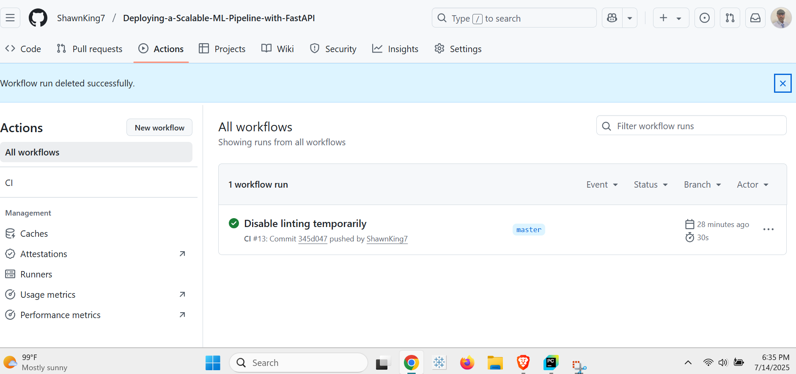
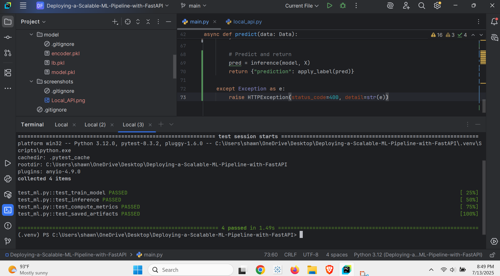

# Deploying a Scalable ML Pipeline with FastAPI

## Project Overview
This project trains a classification model on census data and deploys it via FastAPI. It includes:
- Data preprocessing
- Model training (Random Forest)
- API endpoints
- Comprehensive testing

## Repository Structure
```
.
├── .github/workflows/ci.yml     # CI pipeline
├── data/census.csv              # Raw data
├── model/                       # Saved artifacts
│   ├── model.pkl
│   ├── encoder.pkl
│   └── lb.pkl
├── screenshots/                 # Proof of functionality
│   ├── continuous_integration.png
│   ├── local_api.png
│   └── unit_test.png
├── ml/                          # ML code
├── app/                         # API code
└── requirements.txt             # Dependencies
```

## Key Files
- `train_model.py`: ML training pipeline
- `main.py`: FastAPI application
- `test_ml.py`: Unit tests

## Screenshots
| CI Passing | API Test | Unit Tests |
|------------|----------|------------|
|  |  |  |

GitHub Repository: [https://github.com/ShawnKing7/Deploying-a-Scalable-ML-Pipeline-with-FastAPI](https://github.com/ShawnKing7/Deploying-a-Scalable-ML-Pipeline-with-FastAPI)